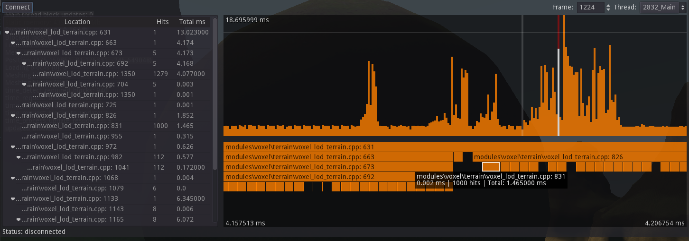

Profiler for Godot
=========================

A CPU time instrumenting profiler for Godot Engine.

This allows to add profiling scopes to any part of the C++ codebase in Godot, so that much better insight about what's happening can be provided to users. Besides, scripts can also make use of it thanks to the recent addition of a `StringName`-based API.

It was primarily used in Voxel Tools C++ codebase as a simple profiling solution, but evolved to become independent. It's still relatively work in progress, but mostly usable.
Old Git history was lost in the migration, but can be found in the `profiler` branch of Voxel Tools.

Features
---------------------------

- Function and scope sampling in C++ by adding a single macro
- API supports either string literal (fastest) or `StringName` for script-friendly usage
- Microsecond accuracy using Godot's time functions
- Low overhead: effort is made for sampling to be very fast. Goals being: no dictionary lookup, no string copies, no allocations, no mutex locking. Only getting time and blitting the info into an array by index.
- Multithreaded: each thread can be recorded independently
- Client/server architecture: the server records, the client displays.
- Client GUI made with Godot nodes, can be embedded in game or in editor
- Timeline with pan & zoom showing all the measured calls
- Tree view showing call hierarchy and time taken
- Sample categories (so we can distinguish easily when an item is in C++ or a script)
- Starts recording when a connection from the client is made

How To Install And Use
-------------------------

ZProfiler is a custom C++ module for Godot 3.1+. It must be compiled into the engine to work.

As is, it doesn't do much apart from recording data if the server gets initialized. To display profiling information, the client must be instanciated and connected to the server. Integrating an instance to the editor is one of the things left to do.

As a module, it holds a particular place because in theory, any place of the engine should be able to use it, while modules are supposed to be optional independent parts, so I'm not sure if a module is the right place to put this system. Including `modules/zprofiler/server/zprofiler.h` and starting to use `ZPROFILER_SCOPE()` should works anyways, though.

Roadmap
---------

These are some ideas that may or may not be implemented in the future:

* Resolving function names in C++ (the preprocessor doesn't know them so they aren't literals)
* Fix issues related to `ThreadLocal` resource management (potential leaks)
* Script API exposition (although it could record automatically by function in GDScript's runtime)
* Save data to files for later inspection (was originally working this way but got removed temporarily)
* True integration with Godot's official profiler, through a PR to the engine
